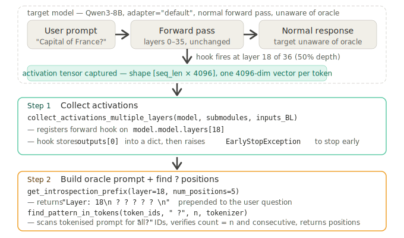
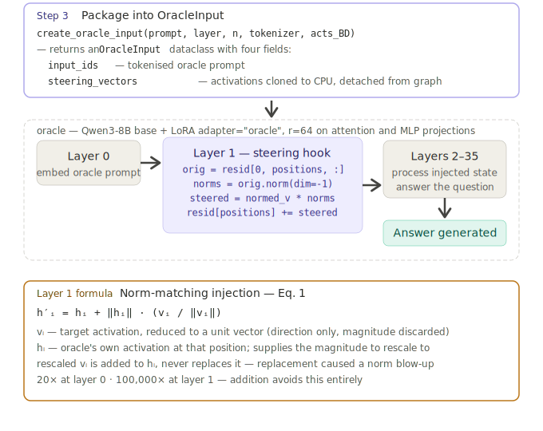

<!-- _class: title -->

# Activation Oracles
## Training and Evaluating LLMs as General-Purpose Activation Explainers

 

Karvonen, A., Chua, J., Dumas, C., Fraser-Taliente, K., Kantamneni, S., Minder, J., Ong, E., Sen Sharma, A., Wen, D., Evans, O., & Marks, S. (2026). <em>Activation Oracles: Training and Evaluating LLMs as General-Purpose Activation Explainers.</em> arXiv:2512.15674 [cs.CL]. https://arxiv.org/abs/2512.15674

Huang, V., Choi, D., Johnson, D. D., Schwettmann, S., & Steinhardt, J. (2025). <em>Predictive Concept Decoders: Training Scalable End-to-End Interpretability Assistants.</em> arXiv:2512.15712 [cs.AI]. https://arxiv.org/abs/2512.15712

---

<!-- _class: content -->

# What Activation Oracles are used for

- Recovering information fine-tuned into a model — biographical facts, malign propensities — that never appears in the input text, even though the oracle was never trained on activations from that fine-tuned model
- Flagship demo: exposing both a secret goal and a secret word from a model secretly fine-tuned to play "Taboo" — purely from activations, not outputs
- **Auditing games** (Section 4) — controlled benchmarks testing whether a tool can uncover fine-tuned knowledge/behavior a model won't reveal through ordinary prompting
  - Secret-keeping: extracting hidden words, gender assumptions, or hidden instructions (Taboo, User Gender, SSC)
  - Emergent misalignment audits: describing what's driving a narrowly misaligned model, given base/fine-tuned activation differences

---

<!-- _class: content -->

# How Activation Oracles are trained

- **Target vs. suspect model:** "target model" is the general role — whoever's activations get captured; a "suspect model" is a target that's been fine-tuned to hide something, used specifically for the auditing evals
- **Key asymmetry:** the oracle is trained *only* on activations from the clean base model — **never** on activations from any fine-tuned/suspect model — yet still generalizes to auditing them
- **Setup:** a LoRA adapter (r=64) on the *same base architecture* as the target it will audit — trained for Llama-3.3-70B-Instruct, Gemma-2-9B-IT, Qwen3-8B, and Claude Haiku 3.5 (full fine-tune, not LoRA)
- **Training data — 3 task types mixed together:**
  - System Prompt QA (SPQA) — infer system-prompt properties from conversation activations
  - Classification — 7 binary NLP tasks (sentiment, language ID, entailment, etc.)
  - Self-supervised context prediction — predict surrounding tokens from an activation sequence, no input/target overlap
- **Scale:** ~1M examples, activations from 3 depths (25/50/75%) of the *base* model; evaluated at 50% depth; 10 H100-hrs (Qwen3-8B) / 90 H200-hrs (Llama-3.3-70B)

---

<!-- _class: diagram -->

# Injection mechanism — how target activations enter the oracle

---

<!-- _class: diagram -->

# Steps 1 & 2 — Collect activations and build the oracle prompt

---

<!-- _class: diagram -->

# Steps 3–5 — Package, inject and generate

---

<!-- _class: content -->

# LoRA (low-rank adaptation)

- Base weight **W** (d×k) stays frozen — never updated during training
- Two small trainable matrices instead: **A** (r×k) and **B** (d×r), with r ≪ d — the oracle uses **r=64**
- Update: **ΔW = B·A**, merged at inference as **W' = W + ΔW**
- Applied to `q_proj, k_proj, v_proj, o_proj, gate_proj, up_proj, down_proj`
- The oracle itself is loaded as a LoRA adapter on the *same base architecture* as the target model

## Worked example (d = 4096, r = 64)

- Frozen weight **W**: 4096 × 4096 ≈ **16.8M** parameters
- Trainable **A**: 64 × 4096, trainable **B**: 4096 × 64 → combined ≈ **524k** parameters
- That's roughly **32× fewer** trainable parameters than fine-tuning **W** directly
- Same idea applies per module — `q_proj, k_proj, v_proj, o_proj, gate_proj, up_proj, down_proj` each get their own small **A**/**B** pair at r = 64

---

<!-- _class: content -->

# Norm-matching injection formula (Eq. 1)

$$\mathbf{h}_i' = \mathbf{h}_i + \|\mathbf{h}_i\| \cdot \frac{\mathbf{v}_i}{\|\mathbf{v}_i\|}$$

- **v**ᵢ — target activation, reduced to a unit vector (direction only); **h**ᵢ — oracle's own activation, supplies the magnitude
- **Norm** ‖v‖ = vector length, e.g. v=[3,4] → ‖v‖=5; **unit vector** v/‖v‖ = [0.6, 0.8] (length 1, same direction)
- **Rescale**: ‖h‖ · unit vector — e.g. if ‖hᵢ‖=12, result is 12·[0.6,0.8]=[7.2,9.6], norm exactly 12, pointing in **v**ᵢ's direction
- Result is **added** to **h**ᵢ, never replaces it — replacement caused **20×** (layer 0) / **100,000×** (layer 1) norm blow-up
- Why norm-match: raw activations from different sources (residual stream, SAE features, diffs) have wildly different magnitudes — rescaling to ‖**h**ᵢ‖ keeps every injection at a scale the oracle already expects, so only *direction* carries new information
